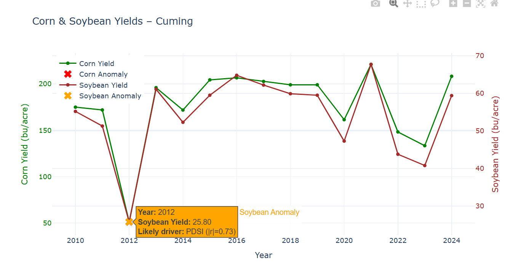
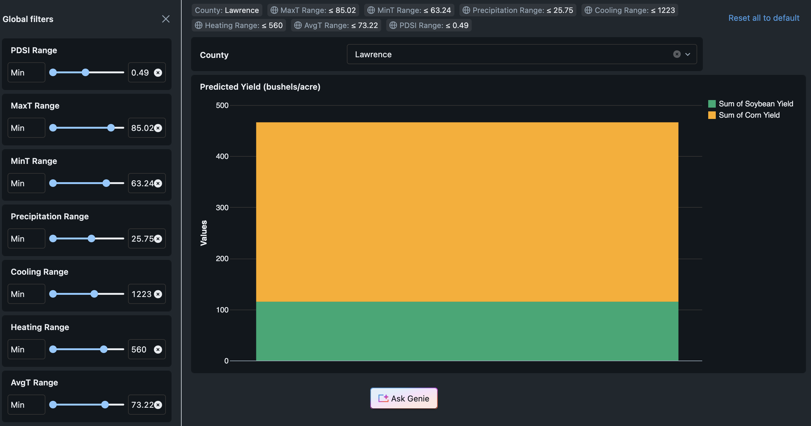

# CropCast — ML Crop Yield Predictor for Small Farmers (Databricks Hackathon)

Contributors: Menaka Aron, Ananya Prakash, Nandini Khandelwal, Raika Roy Choudhury

A data-driven platform that helps small-scale farmers understand how weather conditions across the growing season impact their crop yields. Enter climate parameters for your region and CropCast predicts your expected corn and soybean yields — no agricultural science degree required.

## Demo

<p align="center">
  
  
</p>

## Features

- **Yield prediction** — enter local weather conditions and receive predicted corn and soybean yields for your county
- **Growing season focus** — models trained on May–September data to capture the full crop growing window
- **Drought awareness** — incorporates the Palmer Drought Severity Index (PDSI) so dry spells are factored into predictions
- **Similar county lookup** — find historical counties with matching climate conditions to benchmark expected outcomes
- **Visualization dashboard** — explore how min/max ranges of temperature, precipitation, and drought index shift predicted yields
- **Interactive inputs** — real-time prediction via parameterized widgets; no code knowledge needed

## Tech Stack

| Layer | Technology |
|---|---|
| Language | Python |
| Notebooks | Jupyter / Databricks Notebooks |
| Cloud Platform | Databricks (Apache Spark) |
| Data Processing | PySpark, Pandas, NumPy |
| ML Models | scikit-learn (Random Forest, Linear Regression) |
| Hyperparameter Tuning | Hyperopt (Tree-structured Parzen Estimator) |
| Experiment Tracking | MLflow |
| Storage | Delta Lake, CSV |
| Data Sources | NOAA NCEI (National Centers for Environmental Information), US Census Data API |

## How It Works

1. **Collect** — raw daily weather observations (temperature, precipitation, snowfall) are sourced from NOAA NCEI for corn belt counties across five Midwest states; the US Census Data API converts GPS coordinates to county FIPS codes
2. **Consolidate** — data is filtered to May–September growing seasons (2010–2024), aggregated by county and year, and joined with USDA crop yield records into a single master training table using Databricks SQL and Genie
3. **Train** — multiple regression models (Random Forest, Linear Regression) are trained and compared using MLflow experiment tracking; Random Forest was selected as the best performer; Hyperopt then tunes its `numTrees`, `maxDepth`, and `maxBins` hyperparameters across 15 evaluations to further improve correlation
4. **Predict** — pre-trained models are loaded at inference time; users enter their climate parameters via interactive widgets and receive a predicted yield in bushels per acre
5. **Visualize** — a prediction grid spanning the full min/max range of each feature is generated and stored in a Delta table, powering the interactive dashboard

## Project Structure

```
cropcast/
  Yield Prediction ML Model.ipynb   # End-to-end ML pipeline — data loading, training, hyperopt, real-time prediction widgets
  Final values.ipynb                # Prediction grid generation and visualization dataset creation
  MASTER Corn belt data(FINAL).csv  # Cleaned, aggregated training dataset (76 county-year records)
  large_data.csv                    # Raw NOAA weather station observations (~1.4 MB)
```

## Model Performance

| Crop | Model | R² | RMSE |
|---|---|---|---|
| Corn | Random Forest | 0.231 | 26.231 bu/ac |
| Soybean | Random Forest | 0.395 | 7.120 bu/ac |
| Soybean | Linear Regression | 0.382 | 7.198 bu/ac |

## Input Features

| Feature | Description |
|---|---|
| MaxT | Maximum temperature (°F) during growing season |
| MinT | Minimum temperature (°F) during growing season |
| AvgT | Average temperature (°F) during growing season |
| Precipitation | Total precipitation (inches) |
| Cooling | Cooling degree days |
| Heating | Heating degree days |
| PDSI | Palmer Drought Severity Index |

## Getting Started

1. Open the project in **Databricks** and import both notebooks
2. Attach a cluster with PySpark and MLflow installed
3. Run `Yield Prediction ML Model.ipynb` end-to-end to train and register the models
4. Use the widget inputs at the bottom of the notebook to generate real-time predictions
5. Run `Final values.ipynb` to populate the prediction grid Delta table for the dashboard

> Climate data coverage: Iowa, Illinois, Indiana, Nebraska, and Ohio — 2010–2024 growing seasons.

## Data Sources

- **[NOAA National Centers for Environmental Information](https://www.ncei.noaa.gov/)** — county-level daily temperature, precipitation, drought, and extreme-day records
- **[US Census Data API](https://www.census.gov/data/developers/data-sets.html)** — latitude/longitude to US county conversion
